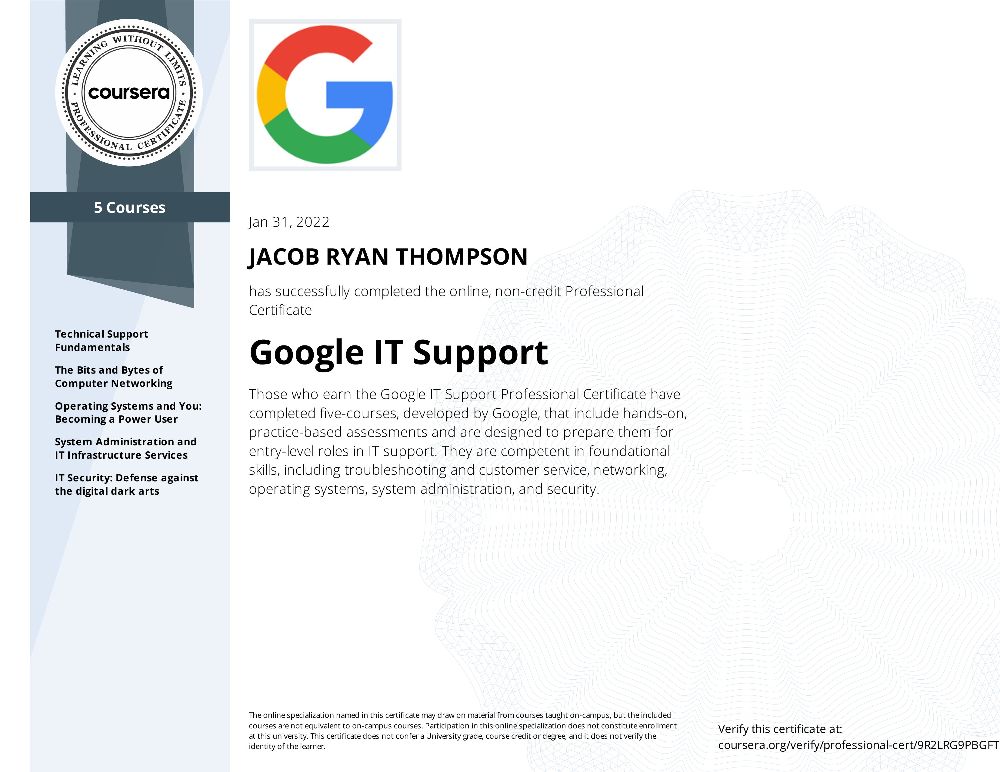
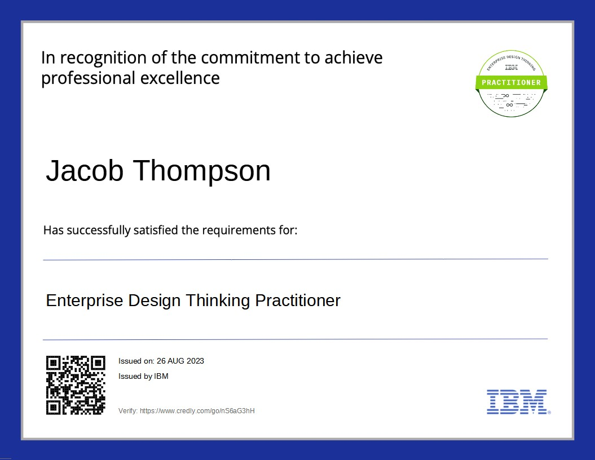
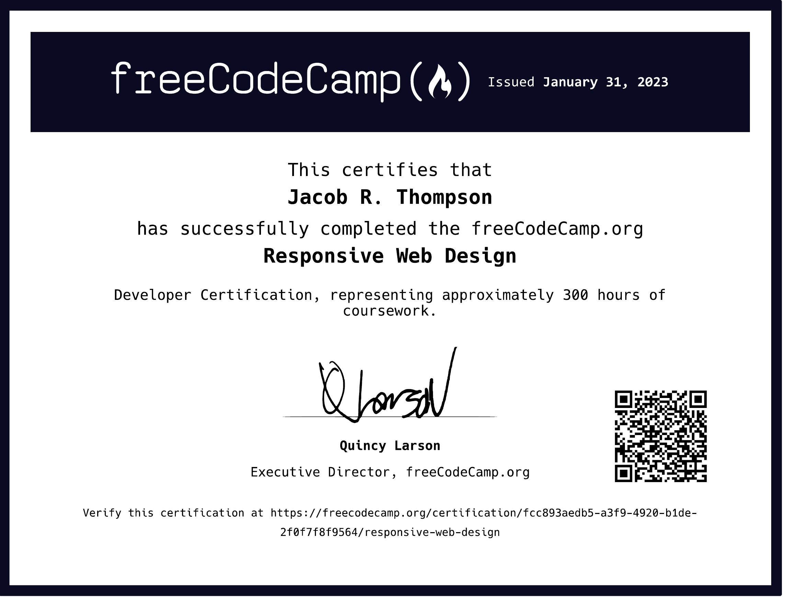

<h1 align="center">Hi 👋, I'm Vampeyer , How are you today ?   -   </h1>
<h3 align="center">A passionate Fullstack developer from Kentucky</h3>
<h6> Please allow the entire page to load to view entire contents </h6>

<section> 

 </section>

<section>  

  

</section>

 
 

 
 

<h1> Certificates </h1> 

 

 

  

 

<!-- BADGES START -->

  

  

- 🔭 I’m currently working on **Phoenix XP Portable OS**

- 🌱 I’m currently learning **Java**

- 👯 I’m looking to collaborate on **Environmental / Corporate ptojects**

- 🤝 I’m looking for help with **Docker**

- 💬 Ask me about **REact , vue , vit , js , express , jupyter , sql , or anything else**

- ⚡ Fun fact **I can do anything you need , I am very chad**

<h1>Badges  </h1>

<h5> UofL / NSA -  Cybersecurityworkforce Professional Certificate </h5>
 <h5> IBM Enterprise Design Thinking Practitioner </h5>
 <h5> Google I.T> Support Certificate </h5>
  <h5> - 10  Badges at Microsoft , with a power level +9000  </h5> 

</section>

<h1>Technologies </h1>

      

[&message=Phoenix+OS+v.0.2.2+-+Portable&color=%2347848F&style=for-the-badge&logo=electron-builder&logoColor=%23efefff)](https://github.com/Vampeyer/winohzXp.git)

<h2> MoreTechnologie  </h2>

### Blogs posts
<!-- BLOG-POST-LIST:START -->
<!-- BLOG-POST-LIST:END -->

<h3 align="left">Connect with me:</h3>

<h3 align="left">Languages and Tools:</h3>

                                        

<h3 align="left">Support:</h3>

  

&nbsp;

  <h4>  Achievements  </h4>
 

  
 
         <a   
            style=" text-decoration: none; color: black; font-family: system-ui, -apple-system, BlinkMacSystemFont, 'Segoe UI', Roboto, Oxygen, Ubuntu, Cantarell, 'Open Sans', 'Helvetica Neue', sans-serif ; "
         href="https://github.com/github-profile-achievements/english">
            
         
  
 Heart on your Sleeve 
            x2
 
         </a>
         

  
 
            <a   
               style=" text-decoration: none; color: black; font-family: system-ui, -apple-system, BlinkMacSystemFont, 'Segoe UI', Roboto, Oxygen, Ubuntu, Cantarell, 'Open Sans', 'Helvetica Neue', sans-serif ; "
            href="https://github.com/github-profile-achievements/english">
               
            
   
Open Sourcerer  
               x3
 
            </a>
            

      

  
 
               <a   
                  style=" text-decoration: none; color: black; font-family: system-ui, -apple-system, BlinkMacSystemFont, 'Segoe UI', Roboto, Oxygen, Ubuntu, Cantarell, 'Open Sans', 'Helvetica Neue', sans-serif ; "
               href="https://github.com/github-profile-achievements/english">
                  
               
   
 Pair Extraordinaire  
                  x 2
 
               </a>
               

   
 
               <a   
                  style=" text-decoration: none; color: black; font-family: system-ui, -apple-system, BlinkMacSystemFont, 'Segoe UI', Roboto, Oxygen, Ubuntu, Cantarell, 'Open Sans', 'Helvetica Neue', sans-serif ; "
               href="https://github.com/github-profile-achievements/english">
                  
               
   
 Quick Draw  x3 
 
                  
 
               </a>
               

    
 
                  <a   
                     style=" text-decoration: none; color: black; font-family: system-ui, -apple-system, BlinkMacSystemFont, 'Segoe UI', Roboto, Oxygen, Ubuntu, Cantarell, 'Open Sans', 'Helvetica Neue', sans-serif ; "
                  href="https://github.com/github-profile-achievements/english">
                     
                  
   
 Arctic Code Vault Contributor 
                     
 
                  </a>
                  

   
 
                     <a   
                        style=" text-decoration: none; color: black; font-family: system-ui, -apple-system, BlinkMacSystemFont, 'Segoe UI', Roboto, Oxygen, Ubuntu, Cantarell, 'Open Sans', 'Helvetica Neue', sans-serif ; "
                     href="https://github.com/github-profile-achievements/english">
                        
                     
   
Starstruck   
                        
 
                     </a>
                     

  
 
                        <a   
                           style=" text-decoration: none; color: black; font-family: system-ui, -apple-system, BlinkMacSystemFont, 'Segoe UI', Roboto, Oxygen, Ubuntu, Cantarell, 'Open Sans', 'Helvetica Neue', sans-serif ; "
                        href="https://github.com/github-profile-achievements/english">
                           
                        
  
 Galaxy Brain   
                           
 
                        </a>
                        

 
                           <a   
                              style=" text-decoration: none; color: black; font-family: system-ui, -apple-system, BlinkMacSystemFont, 'Segoe UI', Roboto, Oxygen, Ubuntu, Cantarell, 'Open Sans', 'Helvetica Neue', sans-serif ; "
                           href="https://github.com/github-profile-achievements/english">
                              
                           
 
 Mars 2020 Contributor  
                              x2
 
                           </a>
                           

  
 
                              <a   
                                 style=" text-decoration: none; color: black; font-family: system-ui, -apple-system, BlinkMacSystemFont, 'Segoe UI', Roboto, Oxygen, Ubuntu, Cantarell, 'Open Sans', 'Helvetica Neue', sans-serif ; "
                              href="https://github.com/github-profile-achievements/english">
                                 
                              
  
Public Sponsor  
                                 
 
                              </a>
                              

                        

  
 
                              <a   
                                 style=" text-decoration: none; color: black; font-family: system-ui, -apple-system, BlinkMacSystemFont, 'Segoe UI', Roboto, Oxygen, Ubuntu, Cantarell, 'Open Sans', 'Helvetica Neue', sans-serif ; "
                              href="https://github.com/github-profile-achievements/english">
                                 
                              
   
Pull Shark   
                                 x4
 
                              </a>
                              

   

 

</body>
</html> 
<!-- BADGES END -->

 
